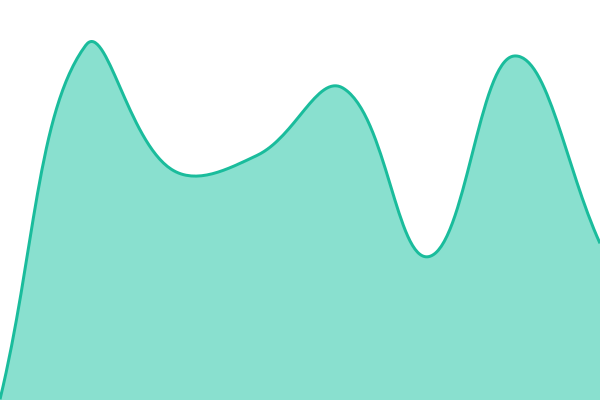

# [📈 Live Status](https://demo.upptime.js.org): <!--live status--> **🟧 Partial outage**

This repository contains the open-source uptime monitor and status page for [Just-Digital-Limited](https://demo.upptime.js.org), powered by [Upptime](https://github.com/upptime/upptime).

With [Upptime](https://upptime.js.org), you can get your own unlimited and free uptime monitor and status page, powered entirely by a GitHub repository. We use [Issues](https://github.com/Just-Digital-Limited/Upptime_WebsiteStatusChecker/issues) as incident reports, [Actions](https://github.com/Just-Digital-Limited/Upptime_WebsiteStatusChecker/actions) as uptime monitors, and [Pages](https://demo.upptime.js.org) for the status page.

<!--start: status pages-->
<!-- This summary is generated by Upptime (https://github.com/upptime/upptime) -->
<!-- Do not edit this manually, your changes will be overwritten -->
<!-- prettier-ignore -->
| URL | Status | History | Response Time | Uptime |
| --- | ------ | ------- | ------------- | ------ |
|  [Graphic Services Reporting (Ultimate)](reporting.graphic-services.co.uk) | 🟩 Up | [graphic-services-reporting-ultimate.yml](https://github.com/Just-Digital-Limited/Upptime_WebsiteStatusChecker/commits/HEAD/history/graphic-services-reporting-ultimate.yml) | 

 1184ms
     
 | 

<a href="https://Just-Digital-Limited.github.io/Upptime_WebsiteStatusChecker/history/graphic-services-reporting-ultimate">96.62%</a>
    

|  [Marketing Services Tools](https://marketingservicestools.justdigital.co.uk) | 🟩 Up | [marketing-services-tools.yml](https://github.com/Just-Digital-Limited/Upptime_WebsiteStatusChecker/commits/HEAD/history/marketing-services-tools.yml) | 

 635ms
     
 | 

<a href="https://Just-Digital-Limited.github.io/Upptime_WebsiteStatusChecker/history/marketing-services-tools">96.63%</a>
    

|  [Dignity Asset Manager](https://assetmanager.dignitystore.co.uk/) | 🟩 Up | [dignity-asset-manager.yml](https://github.com/Just-Digital-Limited/Upptime_WebsiteStatusChecker/commits/HEAD/history/dignity-asset-manager.yml) | 

 611ms
     
 | 

<a href="https://Just-Digital-Limited.github.io/Upptime_WebsiteStatusChecker/history/dignity-asset-manager">96.63%</a>
    

|  [Just Digital Contact List](https://contacts.justdigital.co.uk/) | 🟩 Up | [just-digital-contact-list.yml](https://github.com/Just-Digital-Limited/Upptime_WebsiteStatusChecker/commits/HEAD/history/just-digital-contact-list.yml) | 

 716ms
     
 | 

<a href="https://Just-Digital-Limited.github.io/Upptime_WebsiteStatusChecker/history/just-digital-contact-list">96.63%</a>
    

|  [W2P Ambu Deployment](https://justwebtoprint.co.uk/) | 🟩 Up | [w2-p-ambu-deployment.yml](https://github.com/Just-Digital-Limited/Upptime_WebsiteStatusChecker/commits/HEAD/history/w2-p-ambu-deployment.yml) | 

 425ms
     
 | 

<a href="https://Just-Digital-Limited.github.io/Upptime_WebsiteStatusChecker/history/w2-p-ambu-deployment">100.00%</a>
    

|  [W2P Homefire Deployment](https://homefireonline.co.uk/) | 🟩 Up | [w2-p-homefire-deployment.yml](https://github.com/Just-Digital-Limited/Upptime_WebsiteStatusChecker/commits/HEAD/history/w2-p-homefire-deployment.yml) | 

 428ms
     
 | 

<a href="https://Just-Digital-Limited.github.io/Upptime_WebsiteStatusChecker/history/w2-p-homefire-deployment">100.00%</a>
    

|  [W2P Chanelle Deployment](https://chanellepharmamarketinghub.co.uk/) | 🟥 Down | [w2-p-chanelle-deployment.yml](https://github.com/Just-Digital-Limited/Upptime_WebsiteStatusChecker/commits/HEAD/history/w2-p-chanelle-deployment.yml) | 

 3182ms
     
 | 

<a href="https://Just-Digital-Limited.github.io/Upptime_WebsiteStatusChecker/history/w2-p-chanelle-deployment">99.98%</a>
    

|  [W2P Destination Accomodation Deployment](https://destination.justwebtoprint.co.uk/) | 🟩 Up | [w2-p-destination-accomodation-deployment.yml](https://github.com/Just-Digital-Limited/Upptime_WebsiteStatusChecker/commits/HEAD/history/w2-p-destination-accomodation-deployment.yml) | 

 426ms
     
 | 

<a href="https://Just-Digital-Limited.github.io/Upptime_WebsiteStatusChecker/history/w2-p-destination-accomodation-deployment">100.00%</a>
    

|  [W2P Dignity Deployment](https://dignitystore.co.uk/) | 🟩 Up | [w2-p-dignity-deployment.yml](https://github.com/Just-Digital-Limited/Upptime_WebsiteStatusChecker/commits/HEAD/history/w2-p-dignity-deployment.yml) | 

 472ms
     
 | 

<a href="https://Just-Digital-Limited.github.io/Upptime_WebsiteStatusChecker/history/w2-p-dignity-deployment">100.00%</a>
    

|  [W2P FFT Deployment](https://fftshop.org.uk/) | 🟩 Up | [w2-p-fft-deployment.yml](https://github.com/Just-Digital-Limited/Upptime_WebsiteStatusChecker/commits/HEAD/history/w2-p-fft-deployment.yml) | 

 467ms
     
 | 

<a href="https://Just-Digital-Limited.github.io/Upptime_WebsiteStatusChecker/history/w2-p-fft-deployment">100.00%</a>
    

|  [W2P Fresenius Deployment](https://freseniuspixelstopaper.co.uk/) | 🟥 Down | [w2-p-fresenius-deployment.yml](https://github.com/Just-Digital-Limited/Upptime_WebsiteStatusChecker/commits/HEAD/history/w2-p-fresenius-deployment.yml) | 

 3184ms
     
 | 

<a href="https://Just-Digital-Limited.github.io/Upptime_WebsiteStatusChecker/history/w2-p-fresenius-deployment">100.00%</a>
    

|  [W2P Holroyd Deployment](https://www.hhmarketinghub.co.uk/) | 🟩 Up | [w2-p-holroyd-deployment.yml](https://github.com/Just-Digital-Limited/Upptime_WebsiteStatusChecker/commits/HEAD/history/w2-p-holroyd-deployment.yml) | 

 705ms
     
 | 

<a href="https://Just-Digital-Limited.github.io/Upptime_WebsiteStatusChecker/history/w2-p-holroyd-deployment">100.00%</a>
    

|  [W2P Homes for Students Deployment](https://print.wearehomesforstudents.com/) | 🟩 Up | [w2-p-homes-for-students-deployment.yml](https://github.com/Just-Digital-Limited/Upptime_WebsiteStatusChecker/commits/HEAD/history/w2-p-homes-for-students-deployment.yml) | 

 305ms
     
 | 

<a href="https://Just-Digital-Limited.github.io/Upptime_WebsiteStatusChecker/history/w2-p-homes-for-students-deployment">100.00%</a>
    

|  [W2P Karcher Deployment](https://karcherweb2print.co.uk/) | 🟩 Up | [w2-p-karcher-deployment.yml](https://github.com/Just-Digital-Limited/Upptime_WebsiteStatusChecker/commits/HEAD/history/w2-p-karcher-deployment.yml) | 

 559ms
     
 | 

<a href="https://Just-Digital-Limited.github.io/Upptime_WebsiteStatusChecker/history/w2-p-karcher-deployment">100.00%</a>
    

|  [W2P NHSP Deployment](https://nhsptoolkit.com/) | 🟩 Up | [w2-p-nhsp-deployment.yml](https://github.com/Just-Digital-Limited/Upptime_WebsiteStatusChecker/commits/HEAD/history/w2-p-nhsp-deployment.yml) | 

 344ms
     
 | 

<a href="https://Just-Digital-Limited.github.io/Upptime_WebsiteStatusChecker/history/w2-p-nhsp-deployment">100.00%</a>
    

|  [W2P RSC Deployment](https://rscbrandcentre.co.uk/) | 🟩 Up | [w2-p-rsc-deployment.yml](https://github.com/Just-Digital-Limited/Upptime_WebsiteStatusChecker/commits/HEAD/history/w2-p-rsc-deployment.yml) | 

 569ms
     
 | 

<a href="https://Just-Digital-Limited.github.io/Upptime_WebsiteStatusChecker/history/w2-p-rsc-deployment">100.00%</a>
    

|  [W2P Stem Deployment](https://stemweb2print.com/) | 🟩 Up | [w2-p-stem-deployment.yml](https://github.com/Just-Digital-Limited/Upptime_WebsiteStatusChecker/commits/HEAD/history/w2-p-stem-deployment.yml) | 

 378ms
     
 | 

<a href="https://Just-Digital-Limited.github.io/Upptime_WebsiteStatusChecker/history/w2-p-stem-deployment">100.00%</a>
    

|  [W2P  Tax Assist Deployment](https://taxassist.justdigital.co.uk/) | 🟩 Up | [w2-p-tax-assist-deployment.yml](https://github.com/Just-Digital-Limited/Upptime_WebsiteStatusChecker/commits/HEAD/history/w2-p-tax-assist-deployment.yml) | 

 800ms
     
 | 

<a href="https://Just-Digital-Limited.github.io/Upptime_WebsiteStatusChecker/history/w2-p-tax-assist-deployment">100.00%</a>
    

|  [W2P WOW Deployment](https://wowworldmarketingportal.co.uk/) | 🟩 Up | [w2-p-wow-deployment.yml](https://github.com/Just-Digital-Limited/Upptime_WebsiteStatusChecker/commits/HEAD/history/w2-p-wow-deployment.yml) | 

 582ms
     
 | 

<a href="https://Just-Digital-Limited.github.io/Upptime_WebsiteStatusChecker/history/w2-p-wow-deployment">100.00%</a>
    

|  [Shopify In Memory Pins](https://inmemorypins.co.uk/) | 🟩 Up | [shopify-in-memory-pins.yml](https://github.com/Just-Digital-Limited/Upptime_WebsiteStatusChecker/commits/HEAD/history/shopify-in-memory-pins.yml) | 

 577ms
     
 | 

<a href="https://Just-Digital-Limited.github.io/Upptime_WebsiteStatusChecker/history/shopify-in-memory-pins">100.00%</a>
    

|  [Altrincham Feedback Form](https://altrinchamfeedback.justdigital.co.uk/) | 🟩 Up | [altrincham-feedback-form.yml](https://github.com/Just-Digital-Limited/Upptime_WebsiteStatusChecker/commits/HEAD/history/altrincham-feedback-form.yml) | 

 458ms
     
 | 

<a href="https://Just-Digital-Limited.github.io/Upptime_WebsiteStatusChecker/history/altrincham-feedback-form">96.63%</a>
    

|  [Just Digital Website](https://justdigital.co.uk/) | 🟩 Up | [just-digital-website.yml](https://github.com/Just-Digital-Limited/Upptime_WebsiteStatusChecker/commits/HEAD/history/just-digital-website.yml) | 

 368ms
     
 | 

<a href="https://Just-Digital-Limited.github.io/Upptime_WebsiteStatusChecker/history/just-digital-website">100.00%</a>
    

|  [Just Digital Contacts Page](https://contacts.justdigital.co.uk/) | 🟩 Up | [just-digital-contacts-page.yml](https://github.com/Just-Digital-Limited/Upptime_WebsiteStatusChecker/commits/HEAD/history/just-digital-contacts-page.yml) | 

 705ms
     
 | 

<a href="https://Just-Digital-Limited.github.io/Upptime_WebsiteStatusChecker/history/just-digital-contacts-page">96.63%</a>
    

|  [Dignity Forms](https://forms.dignitystore.co.uk/) | 🟩 Up | [dignity-forms.yml](https://github.com/Just-Digital-Limited/Upptime_WebsiteStatusChecker/commits/HEAD/history/dignity-forms.yml) | 

 700ms
     
 | 

<a href="https://Just-Digital-Limited.github.io/Upptime_WebsiteStatusChecker/history/dignity-forms">96.64%</a>
    

|  [Graphic Services Website](https://funeral-orderofservice.com/) | 🟩 Up | [graphic-services-website.yml](https://github.com/Just-Digital-Limited/Upptime_WebsiteStatusChecker/commits/HEAD/history/graphic-services-website.yml) | 

 474ms
     
 | 

<a href="https://Just-Digital-Limited.github.io/Upptime_WebsiteStatusChecker/history/graphic-services-website">96.64%</a>
    

|  [Let us know Graphic Services](https://letusknow.graphic-services.co.uk/) | 🟩 Up | [let-us-know-graphic-services.yml](https://github.com/Just-Digital-Limited/Upptime_WebsiteStatusChecker/commits/HEAD/history/let-us-know-graphic-services.yml) | 

 725ms
     
 | 

<a href="https://Just-Digital-Limited.github.io/Upptime_WebsiteStatusChecker/history/let-us-know-graphic-services">96.64%</a>
    

|  [Memorial Pages](memorial.graphic-services.co.uk) | 🟩 Up | [memorial-pages.yml](https://github.com/Just-Digital-Limited/Upptime_WebsiteStatusChecker/commits/HEAD/history/memorial-pages.yml) | 

 1477ms
     
 | 

<a href="https://Just-Digital-Limited.github.io/Upptime_WebsiteStatusChecker/history/memorial-pages">96.64%</a>
    

|  [JD Middleware](middleware.justdigital.co.uk) | 🟩 Up | [jd-middleware.yml](https://github.com/Just-Digital-Limited/Upptime_WebsiteStatusChecker/commits/HEAD/history/jd-middleware.yml) | 

 897ms
     
 | 

<a href="https://Just-Digital-Limited.github.io/Upptime_WebsiteStatusChecker/history/jd-middleware">96.64%</a>
    

|  [Pet Pairs](petpairs.justdigital.co.uk) | 🟩 Up | [pet-pairs.yml](https://github.com/Just-Digital-Limited/Upptime_WebsiteStatusChecker/commits/HEAD/history/pet-pairs.yml) | 

 747ms
     
 | 

<a href="https://Just-Digital-Limited.github.io/Upptime_WebsiteStatusChecker/history/pet-pairs">96.65%</a>
    

<!--end: status pages-->

[**Visit our status website →**](https://demo.upptime.js.org)

## 📄 License

- Powered by: [Upptime](https://github.com/upptime/upptime)
- Code: [MIT](./LICENSE) © [Anand Chowdhary](https://anandchowdhary.com)
- Data in the `./history` directory: [Open Database License](https://opendatacommons.org/licenses/odbl/1-0/)
